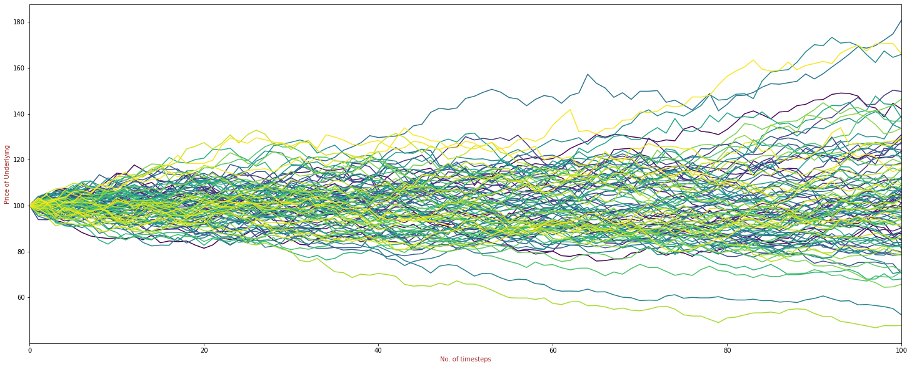
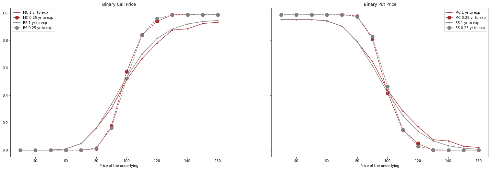
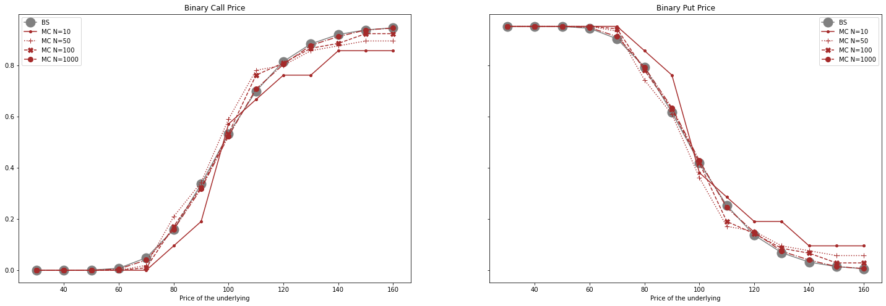
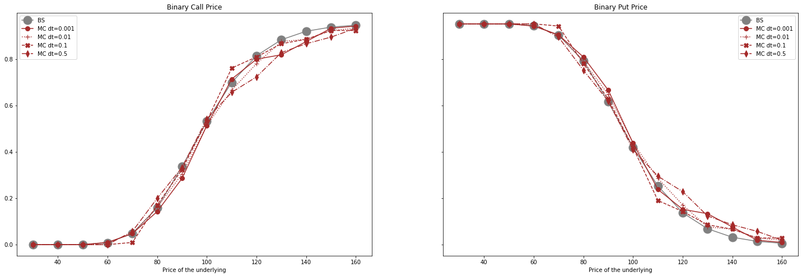
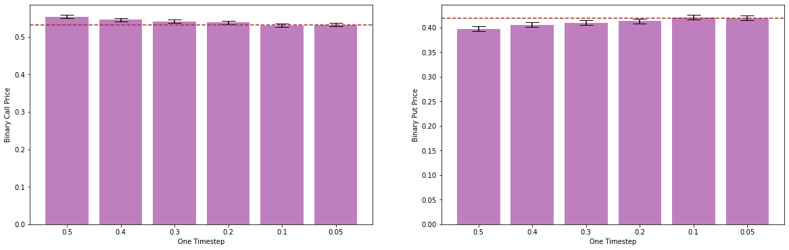

# <font > Monte Carlo approach to price Binary options <font>

## Outline of the approach

Monte Carlo simulation is one of the numerical methods which can be used to price options and is especially useful when closed-form solutions can be difficult to find and/or models/contracts are complex or difficult to evaluate. The Monte Carlo approach can simulate the entire path of the options and can be extremely efficient in incorporating complex path dependencies.
The different steps used in the Monte Carlo approach to price options are outlined below:[<sup>1</sup>](#fn1)

1.	The first step involves simulating the path of the underlying under a risk neutral random walk. Starting with the initial price S0 of the underlying, the idea is to arrive at a final price S using a discretized form of the stochastic differential equation for the underlying, also known as the Euler Maruyama method[<sup>2</sup>](#fn2). It's of the form: $\delta$S=rS$\delta$t+$\sigma$S$\sqrt{\delta t}$$\phi$, where $\phi$ is obtained from a standardized Normal distribution

2.	The simulations are repeated N number of times.

3.	The payoffs of the option under each simulation are calculated and averaged. In case of binary options, the payoff is calculated using the Heaviside function[<sup>3</sup>](#fn3), which gives an option pay-off of 1 if the option is in the money and 0 otherwise. It's mathematically represented as: 

\begin{equation*}
\mathcal{H}\left( x\right) :=\left\{ 
\begin{array}{c}
1,  \\ 
0, 
\end{array}
\begin{array}{c}
x>0 \\ 
x<0
\end{array}
\right.
\end{equation*}

4.	The average payoff is then discounted using the risk-free rate to get the option price.


## Implementation


```python
#Import libraries

import pandas as pd
import numpy as np

import tabulate
import matplotlib.pyplot as plt
import seaborn as sns
from scipy.stats import norm,ttest_ind
import datetime
import tqdm
```


```python
np.random.seed(1)
```


```python
#Initial parameters

S0=100 #Current price of the underlying
E=100 #Strike price
r=0.05 #Constant Risk-free rate
sigma=0.2 #Volatility
T=1 #Time to expiry in yrs

dt=0.01 #Time step used in the MC simulation
N=100 #No. of simulations

```


```python
#Monte Carlo class

class MC:
        
    def __init__(self,spot,strike,r,sigma,tou,dt,N):
        self.spot=spot
        self.strike=strike
        self.r=r
        self.tou=tou
        self.sigma=sigma
        self.dt=dt
        self.N=N
        self.n=int(self.tou/self.dt)
    
    def simulate(self):
        np.random.seed(1)
        S={}
        for k in range(self.N):
            S[k+1,0]=self.spot
            for i in range(self.n):
                #Euler method to simulate the entire path
                S[k+1,i+1]=S[k+1,i]+(self.r*S[k+1,i]*self.dt)+(np.sqrt(self.dt)*S[k+1,i]*self.sigma*norm.ppf(np.random.rand()))

        Sf=pd.DataFrame.from_dict(S,orient='index').rename(columns={0:'S'})
        Sf=Sf.reset_index()
        Sf['sim']=Sf['index'].apply(lambda x:x[0])
        Sf['t']=Sf['index'].apply(lambda x:x[1])
        Sf=Sf.pivot(index='t',columns='sim')['S']
        
        return Sf

    def plot(self):
        Sf=self.simulate()
        
        ax=Sf.plot(figsize=(25,10),legend=False,colormap='viridis')
        ax.set_xlabel('No. of timesteps',color='brown')
        ax.set_ylabel('Price of Underlying',color='brown')
        ax.margins(x=0)

    def payoffs(self):
        Sf=self.simulate()
        final=Sf.T.iloc[:,-1].reset_index()

        #Payoffs
        final['payoff_c']=final[self.n].apply(lambda x:max(x-self.strike,0))
        final['payoff_p']=final[self.n].apply(lambda x:max(self.strike-x,0))

        final['payoff_bc']=final[self.n].apply(lambda x:1 if x-self.strike>0 else 0)
        final['payoff_bp']=final[self.n].apply(lambda x:1 if x-self.strike<0 else 0)
        
        return final
    
    def callPrice(self):
        
        final=self.payoffs()
        call=final.payoff_c.mean()*np.exp(-self.r*(self.tou))
        
        return call

    def putPrice(self):
        
        final=self.payoffs()
        put=final.payoff_p.mean()*np.exp(-self.r*(self.tou))
        
        return put

    def binarycallPrice(self):
        
        final=self.payoffs()
        bcall=final.payoff_bc.mean()*np.exp(-self.r*(self.tou))
        
        return bcall
    
    def binaryputPrice(self):
        
        final=self.payoffs()
        bput=final.payoff_bp.mean()*np.exp(-self.r*(self.tou))
        
        return bput
```


```python
# Simulation of the paths (with 100 simulations) 
print('\nChart 1 : MC Simulations using the Euler Maruyama method')
MC(S0,E,r,sigma,T,dt,100).plot()
```

    
    Chart 1 : MC Simulations using the Euler Maruyama method
    


    

    


```python
#Final Simulated Price Distribution
print('\nChart 2 : Distribution of the final simulated prices')
MC(S0,E,r,sigma,T,dt,100).simulate().iloc[-1,:].plot(kind='hist',cmap='viridis')
plt.show()
```

    
    Chart 2 : Distribution of the final simulated prices
    


    

    


```python
#Payoffs
print('\nChart 3 : Distribution of payoffs')

fig,ax=plt.subplots(nrows=2,ncols=2,figsize=(15,10))
MC(S0,E,r,sigma,T,dt,100).payoffs().payoff_c.plot(kind='hist',cmap='viridis',ax=ax[0,0])
MC(S0,E,r,sigma,T,dt,100).payoffs().payoff_p.plot(kind='hist',cmap='viridis',ax=ax[0,1])
MC(S0,E,r,sigma,T,dt,100).payoffs().payoff_bc.plot(kind='hist',cmap='viridis',ax=ax[1,0])
MC(S0,E,r,sigma,T,dt,100).payoffs().payoff_bp.plot(kind='hist',cmap='viridis',ax=ax[1,1])

ax[0,0].set_title('Call')
ax[0,1].set_title('Put')
ax[1,0].set_title('Binary Call')
ax[1,1].set_title('Binary Put')

plt.show()
```

    
    Chart 3 : Distribution of payoffs
    


    

    


```python
#Check prices by instantiating the MC class

binaryCall_mc=MC(S0,E,r,sigma,T,dt,N).binarycallPrice()
binaryPut_mc=MC(S0,E,r,sigma,T,dt,N).binaryputPrice()

print('\n***Option prices using Monte Carlo***\n')
print('Binary Call price: ', binaryCall_mc)
print('Binary Put price: ', binaryPut_mc)
print('\n')
```

    
    ***Option prices using Monte Carlo***
    
    Binary Call price:  0.5136638892303856
    Binary Put price:  0.4375655352703285
    
    
    

## Comparison wth Black Scholes Option Pricing Formula


```python
#Black Scholes Class for Reference

class BS:

    def __init__(self,spot,strike,r,sigma,tou):
        self.spot=spot
        self.strike=strike
        self.r=r
        self.tou=tou
        self.sigma=sigma
        self.d1=(np.log(self.spot/self.strike)+(self.r+0.5*self.sigma*self.sigma)*self.tou)/(self.sigma*np.sqrt(self.tou))
        self.d2=(np.log(self.spot/self.strike)+(self.r-0.5*self.sigma*self.sigma)*self.tou)/(self.sigma*np.sqrt(self.tou))
    
    def callPrice(self):
        call=self.spot*norm.cdf(self.d1)-self.strike*np.exp(-self.r*self.tou)*norm.cdf(self.d2)
        return call
    
    def putPrice(self):
        put=-self.spot*norm.cdf(-self.d1)+self.strike*np.exp(-self.r*self.tou)*norm.cdf(-self.d2)
        return put
    
    def binarycallPrice(self):
        bcall=np.exp(-self.r*self.tou)*norm.cdf(self.d2)
        return bcall
    
    def binaryputPrice(self):
        bput=np.exp(-self.r*self.tou)*(1-norm.cdf(self.d2))
        return bput
    
```


```python
#Check prices by instantiating the BS class

binaryCall_bs=BS(S0,E,r,sigma,T).binarycallPrice()
binaryPut_bs=BS(S0,E,r,sigma,T).binaryputPrice()

print('\n***Option prices using Black Scholes***\n')
print('Binary Call price: ', binaryCall_bs)
print('Binary Put price: ', binaryPut_bs)
print('\n')
```

    
    ***Option prices using Black Scholes***
    
    Binary Call price:  0.5323248154537634
    Binary Put price:  0.41890460904695065
    
    
    


```python
#Comparison table

#Case 0: Base Case with default parameters

call_MC=MC(S0,E,r,sigma,T,dt,N).callPrice()
call_BS=BS(S0,E,r,sigma,T).callPrice()

put_MC=MC(S0,E,r,sigma,T,dt,N).putPrice()
put_BS=BS(S0,E,r,sigma,T).putPrice()

binaryCall_MC=MC(S0,E,r,sigma,T,dt,N).binarycallPrice()
binaryCall_BS=BS(S0,E,r,sigma,T).binarycallPrice()

binaryPut_MC=MC(S0,E,r,sigma,T,dt,N).binaryputPrice()
binaryPut_BS=BS(S0,E,r,sigma,T).binaryputPrice()

print('\nTable 1: Pricing of different options (Base Case):\n')

print(tabulate.tabulate([['Call',S0,E,r,sigma,T,dt,N,call_MC,call_BS,abs(call_MC/call_BS-1)*100],
                         ['Put',S0,E,r,sigma,T,dt,N,put_MC,put_BS,abs(put_MC/put_BS-1)*100],
                         ['Binary Call',S0,E,r,sigma,T,dt,N,binaryCall_MC,binaryCall_BS,abs(binaryCall_MC/binaryCall_BS-1)*100],
                         ['Binary Put',S0,E,r,sigma,T,dt,N,binaryPut_MC,binaryPut_BS,abs(binaryPut_MC/binaryPut_BS-1)*100],
                        ],headers=['Option','Spot','Strike','r','Vol','Time to expiry','timestep','No. of simulations','Monte Carlo','Black Scholes','Diff %']))
print('\n')

```

    
    Table 1: Pricing of different options (Base Case):
    
    Option         Spot    Strike     r    Vol    Time to expiry    timestep    No. of simulations    Monte Carlo    Black Scholes    Diff %
    -----------  ------  --------  ----  -----  ----------------  ----------  --------------------  -------------  ---------------  --------
    Call            100       100  0.05    0.2                 1        0.01                   100      10.3189          10.4506     1.26038
    Put             100       100  0.05    0.2                 1        0.01                   100       6.53401          5.57353   17.2329
    Binary Call     100       100  0.05    0.2                 1        0.01                   100       0.513664         0.532325   3.50555
    Binary Put      100       100  0.05    0.2                 1        0.01                   100       0.437566         0.418905   4.4547
    
    
    

## Effect of changing parameters on Option prices

### 1. Changing the Spot price/Time to Expiry


```python
#Case 1: Different S with rest of the parameters fixed

tables1=[]
tables2=[]

df1=pd.DataFrame(columns=['Option','Spot','Strike','r','Vol','Time to expiry','timestep','No. of simulations','Monte Carlo','Black Scholes','Diff'])

for tou in tqdm.tqdm([1,0.25]):
    
    for s in np.arange(30,170,10):
           
        binaryCall_MC=MC(s,E,r,sigma,tou,dt,N).binarycallPrice()
        binaryCall_BS=BS(s,E,r,sigma,tou).binarycallPrice()

        binaryPut_MC=MC(s,E,r,sigma,tou,dt,N).binaryputPrice()
        binaryPut_BS=BS(s,E,r,sigma,tou).binaryputPrice()

        df1=df1.append(pd.Series(['Binary Call',s,E,r,sigma,tou,dt,N,binaryCall_MC,binaryCall_BS,abs(binaryCall_MC-binaryCall_BS)],index=df1.columns),ignore_index=True)
        df1=df1.append(pd.Series(['Binary Put',s,E,r,sigma,tou,dt,N,binaryPut_MC,binaryPut_BS,abs(binaryPut_MC-binaryPut_BS)],index=df1.columns),ignore_index=True)

        tables1.append(['Binary Call',s,E,r,sigma,tou,dt,N,binaryCall_MC,binaryCall_BS,abs(binaryCall_MC-binaryCall_BS)])
        tables2.append(['Binary Put',s,E,r,sigma,tou,dt,N,binaryPut_MC,binaryPut_BS,abs(binaryPut_MC-binaryPut_BS)])

print('\nTable 2a: Effect of different Prices/Expiries on Binary Call Prices:\n')
print(tabulate.tabulate([table for table in tables1],headers=['Option','Spot','Strike','r','Vol','Time to expiry','timestep','No. of simulations','Monte Carlo','Black Scholes','Diff']))
print('\n')

print('\nTable 2b: Effect of different Prices/Expiries on Binary Put Prices:\n')
print(tabulate.tabulate([table for table in tables2],headers=['Option','Spot','Strike','r','Vol','Time to expiry','timestep','No. of simulations','Monte Carlo','Black Scholes','Diff']))
print('\n')

#Plot
print('\nChart 4 : Effect of different initial prices')
fig,ax=plt.subplots(1,2, figsize=(25,8), sharey=True)
x=np.arange(30,170,10)
ax[0].plot(x, df1[(df1.Option=='Binary Call') & (df1['Time to expiry']==1)]['Monte Carlo'].tolist(),label='MC 1 yr to exp',color='brown',marker='.')
ax[0].plot(x, df1[(df1.Option=='Binary Call') & (df1['Time to expiry']==0.25)]['Monte Carlo'].tolist(),label='MC 0.25 yr to exp',color='brown',marker='o',linestyle='dashed',markersize=10)
ax[0].plot(x, df1[(df1.Option=='Binary Call') & (df1['Time to expiry']==1)]['Black Scholes'].tolist(),label='BS 1 yr to exp',color='grey',marker='.')
ax[0].plot(x, df1[(df1.Option=='Binary Call') & (df1['Time to expiry']==0.25)]['Black Scholes'].tolist(),label='BS 0.25 yr to exp',color='grey',marker='o',linestyle='dashed',markersize=10)

ax[1].plot(x, df1[(df1.Option=='Binary Put') & (df1['Time to expiry']==1)]['Monte Carlo'].tolist(),label='MC 1 yr to exp',color='brown',marker='.')
ax[1].plot(x, df1[(df1.Option=='Binary Put') & (df1['Time to expiry']==0.25)]['Monte Carlo'].tolist(),label='MC 0.25 yr to exp',color='brown',marker='o',linestyle='dashed',markersize=10)
ax[1].plot(x, df1[(df1.Option=='Binary Put') & (df1['Time to expiry']==1)]['Black Scholes'].tolist(),label='BS 1 yr to exp',color='grey',marker='.')
ax[1].plot(x, df1[(df1.Option=='Binary Put') & (df1['Time to expiry']==0.25)]['Black Scholes'].tolist(),label='BS 0.25 yr to exp',color='grey',marker='o',linestyle='dashed',markersize=10)

ax[0].set_title('Binary Call Price'),ax[1].set_title('Binary Put Price')
ax[0].legend(),ax[1].legend()
ax[0].set_xlabel('Price of the underlying'),ax[1].set_xlabel('Price of the underlying')
plt.show()
```

    
      0%|          | 0/2 [00:00<?, ?it/s]
     50%|█████     | 1/2 [00:35<00:35, 35.56s/it]
    100%|██████████| 2/2 [00:44<00:00, 22.40s/it]
    

    
    Table 2a: Effect of different Prices/Expiries on Binary Call Prices:
    
    Option         Spot    Strike     r    Vol    Time to expiry    timestep    No. of simulations    Monte Carlo    Black Scholes         Diff
    -----------  ------  --------  ----  -----  ----------------  ----------  --------------------  -------------  ---------------  -----------
    Binary Call      30       100  0.05    0.2              1           0.01                   100     0               2.07441e-09  2.07441e-09
    Binary Call      40       100  0.05    0.2              1           0.01                   100     0               4.45175e-06  4.45175e-06
    Binary Call      50       100  0.05    0.2              1           0.01                   100     0               0.000434722  0.000434722
    Binary Call      60       100  0.05    0.2              1           0.01                   100     0.00951229      0.00771023   0.00180206
    Binary Call      70       100  0.05    0.2              1           0.01                   100     0.0475615       0.0486983    0.00113682
    Binary Call      80       100  0.05    0.2              1           0.01                   100     0.161709        0.158944     0.00276549
    Binary Call      90       100  0.05    0.2              1           0.01                   100     0.304393        0.335936     0.0315429
    Binary Call     100       100  0.05    0.2              1           0.01                   100     0.513664        0.532325     0.0186609
    Binary Call     110       100  0.05    0.2              1           0.01                   100     0.665861        0.6987       0.0328395
    Binary Call     120       100  0.05    0.2              1           0.01                   100     0.780008        0.814056     0.0340475
    Binary Call     130       100  0.05    0.2              1           0.01                   100     0.875131        0.882841     0.00770963
    Binary Call     140       100  0.05    0.2              1           0.01                   100     0.884643        0.919412     0.0347686
    Binary Call     150       100  0.05    0.2              1           0.01                   100     0.922693        0.93722      0.014527
    Binary Call     160       100  0.05    0.2              1           0.01                   100     0.932205        0.945323     0.0131181
    Binary Call      30       100  0.05    0.2              0.25        0.01                   100     0               2.685e-33    2.685e-33
    Binary Call      40       100  0.05    0.2              0.25        0.01                   100     0               4.98547e-20  4.98547e-20
    Binary Call      50       100  0.05    0.2              0.25        0.01                   100     0               3.48526e-12  3.48526e-12
    Binary Call      60       100  0.05    0.2              0.25        0.01                   100     0               2.38114e-07  2.38114e-07
    Binary Call      70       100  0.05    0.2              0.25        0.01                   100     0               0.000236954  0.000236954
    Binary Call      80       100  0.05    0.2              0.25        0.01                   100     0.00987578      0.015332     0.00545621
    Binary Call      90       100  0.05    0.2              0.25        0.01                   100     0.177764        0.161852     0.0159123
    Binary Call     100       100  0.05    0.2              0.25        0.01                   100     0.572795        0.52331      0.0494849
    Binary Call     110       100  0.05    0.2              0.25        0.01                   100     0.839441        0.837514     0.00192674
    Binary Call     120       100  0.05    0.2              0.25        0.01                   100     0.938199        0.959102     0.0209032
    Binary Call     130       100  0.05    0.2              0.25        0.01                   100     0.987578        0.98414      0.0034379
    Binary Call     140       100  0.05    0.2              0.25        0.01                   100     0.987578        0.98729      0.000287539
    Binary Call     150       100  0.05    0.2              0.25        0.01                   100     0.987578        0.98756      1.79401e-05
    Binary Call     160       100  0.05    0.2              0.25        0.01                   100     0.987578        0.987577     8.87214e-07
    
    
    
    Table 2b: Effect of different Prices/Expiries on Binary Put Prices:
    
    Option        Spot    Strike     r    Vol    Time to expiry    timestep    No. of simulations    Monte Carlo    Black Scholes         Diff
    ----------  ------  --------  ----  -----  ----------------  ----------  --------------------  -------------  ---------------  -----------
    Binary Put      30       100  0.05    0.2              1           0.01                   100      0.951229       0.951229     2.07441e-09
    Binary Put      40       100  0.05    0.2              1           0.01                   100      0.951229       0.951225     4.45175e-06
    Binary Put      50       100  0.05    0.2              1           0.01                   100      0.951229       0.950795     0.000434722
    Binary Put      60       100  0.05    0.2              1           0.01                   100      0.941717       0.943519     0.00180206
    Binary Put      70       100  0.05    0.2              1           0.01                   100      0.903668       0.902531     0.00113682
    Binary Put      80       100  0.05    0.2              1           0.01                   100      0.78952        0.792286     0.00276549
    Binary Put      90       100  0.05    0.2              1           0.01                   100      0.646836       0.615293     0.0315429
    Binary Put     100       100  0.05    0.2              1           0.01                   100      0.437566       0.418905     0.0186609
    Binary Put     110       100  0.05    0.2              1           0.01                   100      0.285369       0.252529     0.0328395
    Binary Put     120       100  0.05    0.2              1           0.01                   100      0.171221       0.137174     0.0340475
    Binary Put     130       100  0.05    0.2              1           0.01                   100      0.0760984      0.0683887    0.00770963
    Binary Put     140       100  0.05    0.2              1           0.01                   100      0.0665861      0.0318175    0.0347686
    Binary Put     150       100  0.05    0.2              1           0.01                   100      0.0285369      0.0140098    0.014527
    Binary Put     160       100  0.05    0.2              1           0.01                   100      0.0190246      0.00590651   0.0131181
    Binary Put      30       100  0.05    0.2              0.25        0.01                   100      0.987578       0.987578     0
    Binary Put      40       100  0.05    0.2              0.25        0.01                   100      0.987578       0.987578     0
    Binary Put      50       100  0.05    0.2              0.25        0.01                   100      0.987578       0.987578     3.48521e-12
    Binary Put      60       100  0.05    0.2              0.25        0.01                   100      0.987578       0.987578     2.38114e-07
    Binary Put      70       100  0.05    0.2              0.25        0.01                   100      0.987578       0.987341     0.000236954
    Binary Put      80       100  0.05    0.2              0.25        0.01                   100      0.977702       0.972246     0.00545621
    Binary Put      90       100  0.05    0.2              0.25        0.01                   100      0.809814       0.825726     0.0159123
    Binary Put     100       100  0.05    0.2              0.25        0.01                   100      0.414783       0.464268     0.0494849
    Binary Put     110       100  0.05    0.2              0.25        0.01                   100      0.148137       0.150063     0.00192674
    Binary Put     120       100  0.05    0.2              0.25        0.01                   100      0.0493789      0.0284757    0.0209032
    Binary Put     130       100  0.05    0.2              0.25        0.01                   100      0              0.0034379    0.0034379
    Binary Put     140       100  0.05    0.2              0.25        0.01                   100      0              0.000287539  0.000287539
    Binary Put     150       100  0.05    0.2              0.25        0.01                   100      0              1.79401e-05  1.79401e-05
    Binary Put     160       100  0.05    0.2              0.25        0.01                   100      0              8.87214e-07  8.87214e-07
    
    
    
    Chart 4 : Effect of different initial prices
    


    

    


#### Comment: The out of money option becomes less valuable (for a given spot price of the underlying) as it approaches expiry.

### 2. Changing the risk free rate


```python
#Case 2: Different r with rest of the parameters fixed

tables1=[]
tables2=[]

df2=pd.DataFrame(columns=['Option','Spot','Strike','r','Vol','Time to expiry','timestep','No. of simulations','Monte Carlo','Black Scholes','Diff'])

for r_ in tqdm.tqdm(np.arange(0,0.05,0.005)):

    binaryCall_MC=MC(S0,E,r_,sigma,T,dt,N).binarycallPrice()
    binaryCall_BS=BS(S0,E,r_,sigma,T).binarycallPrice()

    binaryPut_MC=MC(S0,E,r_,sigma,T,dt,N).binaryputPrice()
    binaryPut_BS=BS(S0,E,r_,sigma,T).binaryputPrice()
    
    df2=df2.append(pd.Series(['Binary Call',S0,E,r_,sigma,T,dt,N,binaryCall_MC,binaryCall_BS,abs(binaryCall_MC-binaryCall_BS)],index=df2.columns),ignore_index=True)
    df2=df2.append(pd.Series(['Binary Put',S0,E,r_,sigma,T,dt,N,binaryPut_MC,binaryPut_BS,abs(binaryPut_MC-binaryPut_BS)],index=df2.columns),ignore_index=True)
    
    tables1.append(['Binary Call',S0,E,r_,sigma,T,dt,N,binaryCall_MC,binaryCall_BS,abs(binaryCall_MC-binaryCall_BS)])
    tables2.append(['Binary Put',S0,E,r_,sigma,T,dt,N,binaryPut_MC,binaryPut_BS,abs(binaryPut_MC-binaryPut_BS)])

print('\nTable 3a: Effect of r on Binary Call Prices:\n')
print(tabulate.tabulate([table for table in tables1],headers=['Option','Spot','Strike','r','Vol','Time to expiry','timestep','No. of simulations','Monte Carlo','Black Scholes','Diff']))
print('\n')

print('\nTable 3b: Effect of r on Binary Put Prices:\n')
print(tabulate.tabulate([table for table in tables2],headers=['Option','Spot','Strike','r','Vol','Time to expiry','timestep','No. of simulations','Monte Carlo','Black Scholes','Diff']))
print('\n')

#Plot
print('\nChart 5 : Effect of different risk-free rates')
fig,ax=plt.subplots(1,2, figsize=(25,8), sharey=True)
x=np.arange(0,0.05,0.005)
ax[0].plot(x, df2[df2.Option=='Binary Call']['Monte Carlo'].tolist(),label='MC',color='brown')
ax[0].plot(x, df2[df2.Option=='Binary Call']['Black Scholes'].tolist(),label='BS',color='grey')
ax[1].plot(x, df2[df2.Option=='Binary Put']['Monte Carlo'].tolist(),label='MC',color='brown')
ax[1].plot(x, df2[df2.Option=='Binary Put']['Black Scholes'].tolist(),label='BS',color='grey')
ax[0].set_title('Binary Call Price'),ax[1].set_title('Binary Put Price')
ax[0].legend(),ax[1].legend()
ax[0].set_xlabel('Risk free rate'),ax[1].set_xlabel('Risk free rate')
plt.show()
```

    
      0%|          | 0/10 [00:00<?, ?it/s]
     10%|█         | 1/10 [00:02<00:22,  2.55s/it]
     20%|██        | 2/10 [00:05<00:20,  2.53s/it]
     30%|███       | 3/10 [00:07<00:17,  2.54s/it]
     40%|████      | 4/10 [00:10<00:15,  2.54s/it]
     50%|█████     | 5/10 [00:12<00:12,  2.55s/it]
     60%|██████    | 6/10 [00:15<00:10,  2.56s/it]
     70%|███████   | 7/10 [00:17<00:07,  2.57s/it]
     80%|████████  | 8/10 [00:20<00:05,  2.58s/it]
     90%|█████████ | 9/10 [00:23<00:02,  2.60s/it]
    100%|██████████| 10/10 [00:25<00:00,  2.57s/it]
    

    
    Table 3a: Effect of r on Binary Call Prices:
    
    Option         Spot    Strike      r    Vol    Time to expiry    timestep    No. of simulations    Monte Carlo    Black Scholes         Diff
    -----------  ------  --------  -----  -----  ----------------  ----------  --------------------  -------------  ---------------  -----------
    Binary Call     100       100  0        0.2                 1        0.01                   100       0.42             0.460172  0.0401722
    Binary Call     100       100  0.005    0.2                 1        0.01                   100       0.437805         0.467763  0.0299572
    Binary Call     100       100  0.01     0.2                 1        0.01                   100       0.455423         0.475285  0.0198616
    Binary Call     100       100  0.015    0.2                 1        0.01                   100       0.482705         0.482732  2.70727e-05
    Binary Call     100       100  0.02     0.2                 1        0.01                   100       0.499901         0.490099  0.00980199
    Binary Call     100       100  0.025    0.2                 1        0.01                   100       0.507161         0.497381  0.0097799
    Binary Call     100       100  0.03     0.2                 1        0.01                   100       0.504632         0.504572  5.93856e-05
    Binary Call     100       100  0.035    0.2                 1        0.01                   100       0.502115         0.511667  0.00955239
    Binary Call     100       100  0.04     0.2                 1        0.01                   100       0.518826         0.518661  0.000165412
    Binary Call     100       100  0.045    0.2                 1        0.01                   100       0.516239         0.525548  0.00930972
    
    
    
    Table 3b: Effect of r on Binary Put Prices:
    
    Option        Spot    Strike      r    Vol    Time to expiry    timestep    No. of simulations    Monte Carlo    Black Scholes         Diff
    ----------  ------  --------  -----  -----  ----------------  ----------  --------------------  -------------  ---------------  -----------
    Binary Put     100       100  0        0.2                 1        0.01                   100       0.58             0.539828  0.0401722
    Binary Put     100       100  0.005    0.2                 1        0.01                   100       0.557207         0.52725   0.0299572
    Binary Put     100       100  0.01     0.2                 1        0.01                   100       0.534627         0.514765  0.0198616
    Binary Put     100       100  0.015    0.2                 1        0.01                   100       0.502407         0.50238   2.70727e-05
    Binary Put     100       100  0.02     0.2                 1        0.01                   100       0.480297         0.490099  0.00980199
    Binary Put     100       100  0.025    0.2                 1        0.01                   100       0.468149         0.477929  0.0097799
    Binary Put     100       100  0.03     0.2                 1        0.01                   100       0.465814         0.465873  5.93856e-05
    Binary Put     100       100  0.035    0.2                 1        0.01                   100       0.463491         0.453938  0.00955239
    Binary Put     100       100  0.04     0.2                 1        0.01                   100       0.441963         0.442129  0.000165412
    Binary Put     100       100  0.045    0.2                 1        0.01                   100       0.439759         0.430449  0.00930972
    
    
    
    Chart 5 : Effect of different risk-free rates
    


    

    


#### Comment: Increasing r raises the call price and lowers the put price

### 3. Changing the number of simulations


```python
#Case 3: Different N/S with rest of the parameters fixed

dt=0.1

# tables1=[]
# tables2=[]

df3=pd.DataFrame(columns=['Option','Spot','Strike','r','Vol','Time to expiry','timestep','No. of simulations','Monte Carlo','Black Scholes','Diff'])

for N_ in tqdm.tqdm([10,50,100,500,1000]):
    
    for s in (np.arange(30,170,10)):
           
        binaryCall_MC=MC(s,E,r,sigma,T,dt,N_).binarycallPrice()
        binaryCall_BS=BS(s,E,r,sigma,T).binarycallPrice()

        binaryPut_MC=MC(s,E,r,sigma,T,dt,N_).binaryputPrice()
        binaryPut_BS=BS(s,E,r,sigma,T).binaryputPrice()

        df3=df3.append(pd.Series(['Binary Call',s,E,r,sigma,T,dt,N_,binaryCall_MC,binaryCall_BS,abs(binaryCall_MC-binaryCall_BS)],index=df3.columns),ignore_index=True)
        df3=df3.append(pd.Series(['Binary Put',s,E,r,sigma,T,dt,N_,binaryPut_MC,binaryPut_BS,abs(binaryPut_MC-binaryPut_BS)],index=df3.columns),ignore_index=True)

        tables1.append(['Binary Call',s,E,r,sigma,T,dt,N_,binaryCall_MC,binaryCall_BS,abs(binaryCall_MC-binaryCall_BS)])
        tables2.append(['Binary Put',s,E,r,sigma,T,dt,N_,binaryPut_MC,binaryPut_BS,abs(binaryPut_MC-binaryPut_BS)])

# print('\nTable 4: Effect of different Prices/Expiries on Binary Call Prices:\n')
# print(tabulate.tabulate([table for table in tables1],headers=['Option','Spot','Strike','r','Vol','Time to expiry','timestep','No. of simulations','Monte Carlo','Black Scholes','Diff']))
# print('\n')

# print('\nTable 4b: Effect of different Prices/Expiries on Binary Put Prices:\n')
# print(tabulate.tabulate([table for table in tables2],headers=['Option','Spot','Strike','r','Vol','Time to expiry','timestep','No. of simulations','Monte Carlo','Black Scholes','Diff']))
# print('\n')

#Plot
print('\nChart 6a : Effect of different no. of simulations')
fig,ax=plt.subplots(1,2, figsize=(25,8), sharey=True)
x=np.arange(30,170,10)

ax[0].plot(x, df3[(df3.Option=='Binary Call') & (df3['No. of simulations']==10)]['Black Scholes'].tolist(),label='BS',color='grey',marker='o',markersize=15)
ax[0].plot(x, df3[(df3.Option=='Binary Call') & (df3['No. of simulations']==10)]['Monte Carlo'].tolist(),label='MC N=10',color='brown',marker='.',linestyle='solid',markersize=8)
ax[0].plot(x, df3[(df3.Option=='Binary Call') & (df3['No. of simulations']==50)]['Monte Carlo'].tolist(),label='MC N=50',color='brown',marker='+',linestyle='dotted',markersize=8)
ax[0].plot(x, df3[(df3.Option=='Binary Call') & (df3['No. of simulations']==100)]['Monte Carlo'].tolist(),label='MC N=100',color='brown',marker='X',linestyle='dashed',markersize=8)
ax[0].plot(x, df3[(df3.Option=='Binary Call') & (df3['No. of simulations']==1000)]['Monte Carlo'].tolist(),label='MC N=1000',color='brown',marker='o',linestyle='dashdot',markersize=8)

ax[1].plot(x, df3[(df3.Option=='Binary Put') & (df3['No. of simulations']==10)]['Black Scholes'].tolist(),label='BS',color='grey',marker='o',markersize=15)
ax[1].plot(x, df3[(df3.Option=='Binary Put') & (df3['No. of simulations']==10)]['Monte Carlo'].tolist(),label='MC N=10',color='brown',marker='.',linestyle='solid',markersize=8)
ax[1].plot(x, df3[(df3.Option=='Binary Put') & (df3['No. of simulations']==50)]['Monte Carlo'].tolist(),label='MC N=50',color='brown',marker='+',linestyle='dotted',markersize=8)
ax[1].plot(x, df3[(df3.Option=='Binary Put') & (df3['No. of simulations']==100)]['Monte Carlo'].tolist(),label='MC N=100',color='brown',marker='X',linestyle='dashed',markersize=8)
ax[1].plot(x, df3[(df3.Option=='Binary Put') & (df3['No. of simulations']==1000)]['Monte Carlo'].tolist(),label='MC N=1000',color='brown',marker='o',linestyle='dashdot',markersize=8)

ax[0].set_title('Binary Call Price'),ax[1].set_title('Binary Put Price')
ax[0].legend(),ax[1].legend()
ax[0].set_xlabel('Price of the underlying'),ax[1].set_xlabel('Price of the underlying')
plt.show()
```

    
      0%|          | 0/5 [00:00<?, ?it/s]
     20%|██        | 1/5 [00:00<00:02,  1.39it/s]
     40%|████      | 2/5 [00:02<00:04,  1.57s/it]
     60%|██████    | 3/5 [00:06<00:05,  2.61s/it]
     80%|████████  | 4/5 [00:24<00:08,  8.66s/it]
    100%|██████████| 5/5 [01:00<00:00, 12.17s/it]
    

    
    Chart 6a : Effect of different no. of simulations
    


    

    


```python
#Error Lines

binaryCall_BS=BS(S0,E,r,sigma,T).binarycallPrice()
binaryPut_BS=BS(S0,E,r,sigma,T).binaryputPrice()

err1_c=pd.DataFrame(columns=['N','mean','std','se'])
err1_p=pd.DataFrame(columns=['N','mean','std','se'])

for N_ in tqdm.tqdm([10,50,100,500,1000,5000]):
    
    mean=MC(S0,E,r,sigma,T,dt,N_).payoffs().payoff_bc.apply(lambda x:np.exp(-r*T)*x).mean()
    std=MC(S0,E,r,sigma,T,dt,N_).payoffs().payoff_bc.apply(lambda x:np.exp(-r*T)*x).std()
    se=std/np.sqrt(N_)
    err1_c=err1_c.append(pd.Series([str(N_),mean,std,se],index=err1_c.columns),ignore_index=True)

    mean=MC(S0,E,r,sigma,T,dt,N_).payoffs().payoff_bp.apply(lambda x:np.exp(-r*T)*x).mean()
    std=MC(S0,E,r,sigma,T,dt,N_).payoffs().payoff_bp.apply(lambda x:np.exp(-r*T)*x).std()
    se=std/np.sqrt(N_)
    err1_p=err1_p.append(pd.Series([str(N_),mean,std,se],index=err1_p.columns),ignore_index=True)

```

    
      0%|          | 0/6 [00:00<?, ?it/s]
     17%|█▋        | 1/6 [00:00<00:00,  9.20it/s]
     33%|███▎      | 2/6 [00:00<00:00,  4.59it/s]
     50%|█████     | 3/6 [00:00<00:01,  2.78it/s]
     67%|██████▋   | 4/6 [00:03<00:02,  1.23s/it]
     83%|████████▎ | 5/6 [00:08<00:02,  2.62s/it]
    100%|██████████| 6/6 [00:34<00:00,  5.77s/it]
    


```python
print('\nChart 6b')

fig,ax = plt.subplots(1,2,figsize=(20,6))

ax[0].bar(err1_c['N'],err1_c['mean'],yerr=err1_c['se'],align='center',alpha=0.5,capsize=10,color='purple')
ax[0].axhline(binaryCall_BS,color='brown',linestyle='--')
ax[0].set_xlabel('No. of paths')
ax[0].set_ylabel('Binary Call Price')

ax[1].bar(err1_p['N'],err1_p['mean'],yerr=err1_p['se'],align='center',alpha=0.5,capsize=10,color='purple')
ax[1].axhline(binaryPut_BS,color='brown',linestyle='--')
ax[1].set_xlabel('No. of paths')
ax[1].set_ylabel('Binary Put Price')

plt.show()
```

    
    Chart 6b
    


    

    


#### Comment: Increasing N increases accuracy

### 4. Changing the timestep


```python
#Case 4: Different dt with rest of the parameters fixed

N=100
dt=0.01

df4=pd.DataFrame(columns=['Option','Spot','Strike','r','Vol','Time to expiry','timestep','No. of simulations','Monte Carlo','Black Scholes','Diff'])

for dt_ in tqdm.tqdm([0.001,0.01,0.1,0.5]):
    
    for s in np.arange(30,170,10):
           
        binaryCall_MC=MC(s,E,r,sigma,T,dt_,N).binarycallPrice()
        binaryCall_BS=BS(s,E,r,sigma,T).binarycallPrice()

        binaryPut_MC=MC(s,E,r,sigma,T,dt_,N).binaryputPrice()
        binaryPut_BS=BS(s,E,r,sigma,T).binaryputPrice()

        df4=df4.append(pd.Series(['Binary Call',s,E,r,sigma,T,dt_,N,binaryCall_MC,binaryCall_BS,abs(binaryCall_MC-binaryCall_BS)],index=df4.columns),ignore_index=True)
        df4=df4.append(pd.Series(['Binary Put',s,E,r,sigma,T,dt_,N,binaryPut_MC,binaryPut_BS,abs(binaryPut_MC-binaryPut_BS)],index=df4.columns),ignore_index=True)

        tables1.append(['Binary Call',s,E,r,sigma,T,dt_,N,binaryCall_MC,binaryCall_BS,abs(binaryCall_MC-binaryCall_BS)])
        tables2.append(['Binary Put',s,E,r,sigma,T,dt_,N,binaryPut_MC,binaryPut_BS,abs(binaryPut_MC-binaryPut_BS)])

# print('\nTable 4: Effect of different Prices/Expiries on Binary Call Prices:\n')
# print(tabulate.tabulate([table for table in tables1],headers=['Option','Spot','Strike','r','Vol','Time to expiry','timestep','No. of simulations','Monte Carlo','Black Scholes','Diff']))
# print('\n')

# print('\nTable 4b: Effect of different Prices/Expiries on Binary Put Prices:\n')
# print(tabulate.tabulate([table for table in tables2],headers=['Option','Spot','Strike','r','Vol','Time to expiry','timestep','No. of simulations','Monte Carlo','Black Scholes','Diff']))
# print('\n')

#Plot
print('\nChart 7a : Effect of different timesteps')
fig,ax=plt.subplots(1,2, figsize=(25,8), sharey=True)
x=np.arange(30,170,10)

ax[0].plot(x, df4[(df4.Option=='Binary Call') & (df4['timestep']==0.1)]['Black Scholes'].tolist(),label='BS',color='grey',marker='o',markersize=15)
ax[0].plot(x, df4[(df4.Option=='Binary Call') & (df4['timestep']==0.001)]['Monte Carlo'].tolist(),label='MC dt=0.001',color='brown',marker='o',linestyle='solid',markersize=8)
ax[0].plot(x, df4[(df4.Option=='Binary Call') & (df4['timestep']==0.01)]['Monte Carlo'].tolist(),label='MC dt=0.01',color='brown',marker='+',linestyle='dotted',markersize=8)
ax[0].plot(x, df4[(df4.Option=='Binary Call') & (df4['timestep']==0.1)]['Monte Carlo'].tolist(),label='MC dt=0.1',color='brown',marker='X',linestyle='dashed',markersize=8)
ax[0].plot(x, df4[(df4.Option=='Binary Call') & (df4['timestep']==0.5)]['Monte Carlo'].tolist(),label='MC dt=0.5',color='brown',marker='d',linestyle='dashdot',markersize=8)

ax[1].plot(x, df4[(df4.Option=='Binary Put') & (df4['timestep']==0.1)]['Black Scholes'].tolist(),label='BS',color='grey',marker='o',markersize=15)
ax[1].plot(x, df4[(df4.Option=='Binary Put') & (df4['timestep']==0.001)]['Monte Carlo'].tolist(),label='MC dt=0.001',color='brown',marker='o',linestyle='solid',markersize=8)
ax[1].plot(x, df4[(df4.Option=='Binary Put') & (df4['timestep']==0.01)]['Monte Carlo'].tolist(),label='MC dt=0.01',color='brown',marker='+',linestyle='dotted',markersize=8)
ax[1].plot(x, df4[(df4.Option=='Binary Put') & (df4['timestep']==0.1)]['Monte Carlo'].tolist(),label='MC dt=0.1',color='brown',marker='X',linestyle='dashed',markersize=8)
ax[1].plot(x, df4[(df4.Option=='Binary Put') & (df4['timestep']==0.5)]['Monte Carlo'].tolist(),label='MC dt=0.5',color='brown',marker='d',linestyle='dashdot',markersize=8)


ax[0].set_title('Binary Call Price'),ax[1].set_title('Binary Put Price')
ax[0].legend(),ax[1].legend()
ax[0].set_xlabel('Price of the underlying'),ax[1].set_xlabel('Price of the underlying')
plt.show()
```

    
      0%|          | 0/4 [00:00<?, ?it/s]
     25%|██▌       | 1/4 [05:51<17:34, 351.59s/it]
     50%|█████     | 2/4 [06:27<05:31, 165.88s/it]
     75%|███████▌  | 3/4 [06:31<01:31, 91.90s/it] 
    100%|██████████| 4/4 [06:32<00:00, 98.11s/it]
    

    
    Chart 7a : Effect of different timesteps
    


    

    


```python
#Error Lines

N_=10000

binaryCall_BS=BS(S0,E,r,sigma,T).binarycallPrice()
binaryPut_BS=BS(S0,E,r,sigma,T).binaryputPrice()

err2_c=pd.DataFrame(columns=['Timestep','mean','std','se'])
err2_p=pd.DataFrame(columns=['Timestep','mean','std','se'])

for dt_ in tqdm.tqdm([0.5,0.4,0.3,0.2,0.1,0.05]):
    
    mean=MC(S0,E,r,sigma,T,dt_,N_).payoffs().payoff_bc.apply(lambda x:np.exp(-r*T)*x).mean()
    std=MC(S0,E,r,sigma,T,dt_,N_).payoffs().payoff_bc.apply(lambda x:np.exp(-r*T)*x).std()
    se=std/np.sqrt(N_)
    err2_c=err2_c.append(pd.Series([str(dt_),mean,std,se],index=err2_c.columns),ignore_index=True)

    mean=MC(S0,E,r,sigma,T,dt_,N_).payoffs().payoff_bp.apply(lambda x:np.exp(-r*T)*x).mean()
    std=MC(S0,E,r,sigma,T,dt_,N_).payoffs().payoff_bp.apply(lambda x:np.exp(-r*T)*x).std()
    se=std/np.sqrt(N_)
    err2_p=err2_p.append(pd.Series([str(dt_),mean,std,se],index=err2_p.columns),ignore_index=True)

```

    
      0%|          | 0/6 [00:00<?, ?it/s]
     17%|█▋        | 1/6 [00:10<00:51, 10.32s/it]
     33%|███▎      | 2/6 [00:20<00:41, 10.37s/it]
     50%|█████     | 3/6 [00:36<00:38, 12.79s/it]
     67%|██████▋   | 4/6 [01:03<00:36, 18.43s/it]
     83%|████████▎ | 5/6 [01:53<00:29, 29.82s/it]
    100%|██████████| 6/6 [03:33<00:00, 35.52s/it]
    


```python
print('\nChart 7b')

fig,ax = plt.subplots(1,2,figsize=(20,6))

ax[0].bar(err2_c['Timestep'],err2_c['mean'],yerr=err2_c['se'],align='center',alpha=0.5,capsize=10,color='purple')
ax[0].axhline(binaryCall_BS,color='brown',linestyle='--')
ax[0].set_xlabel('One Timestep')
ax[0].set_ylabel('Binary Call Price')

ax[1].bar(err2_p['Timestep'],err2_p['mean'],yerr=err2_p['se'],align='center',alpha=0.5,capsize=10,color='purple')
ax[1].axhline(binaryPut_BS,color='brown',linestyle='--')
ax[1].set_xlabel('One Timestep')
ax[1].set_ylabel('Binary Put Price')

plt.show()
```

    
    Chart 7b
    


    

    


#### Comment: Effect of the timestep is not as pronounced as seen with the number of paths.

## Errors and Computation Time

<li>As seen in the charts in the last two sections above, the error $\epsilon$ in the MC computations depends on the timestep $\delta$t (due to the discretized form of the SDE) and the number of simulations N (finite number of simulations).
<li>The error scales directly with $\delta$t and inversely to the square root of N. i.e., $\epsilon$ $\alpha$ $O$($\delta$t) and $\epsilon$ $\alpha$ $O$(N$^{-1/2}$)
<li>Computation time is of the order of $O$($\epsilon$$^{-3}$), which is proportional to the number of calculations.
<li>This implies that reducing the error by half would take 8 times as long.
<li>This is demonstrated below using the MC pricing of a binary call.


```python
df=pd.DataFrame(columns=['N','dt','Computation Time','SE'])

Ns=[10,50,100,500,1000,5000,10000,50000,100000]

for i in tqdm.tqdm(range(len(Ns))):
    t1=datetime.datetime.now()
    binaryCall_MC=MC(S0,E,r,sigma,T,dt,int(Ns[i])).binarycallPrice()
    t2=datetime.datetime.now()
    
    std=MC(S0,E,r,sigma,T,dt,Ns[i]).payoffs().payoff_bc.apply(lambda x:np.exp(-r*T)*x).std()
    se=std/np.sqrt(Ns[i])
    
    time=(t2-t1).seconds
    
    df=df.append(pd.Series([Ns[i],dt,time,se],index=df.columns),ignore_index=True)
```

    
      0%|          | 0/9 [00:00<?, ?it/s]
     11%|█         | 1/9 [00:00<00:02,  3.52it/s]
     22%|██▏       | 2/9 [00:01<00:06,  1.16it/s]
     33%|███▎      | 3/9 [00:04<00:09,  1.60s/it]
     44%|████▍     | 4/9 [00:16<00:29,  5.93s/it]
     56%|█████▌    | 5/9 [00:42<00:51, 12.96s/it]
     67%|██████▋   | 6/9 [02:50<02:36, 52.11s/it]
     78%|███████▊  | 7/9 [07:24<04:09, 124.75s/it]
     89%|████████▉ | 8/9 [30:26<08:45, 525.01s/it]
    100%|██████████| 9/9 [1:14:54<00:00, 499.37s/it] 
    


```python
print('\nTable 4 : Accuracies and Computation Time\n')
df
```

    
    Table 4 : Accuracies and Computation Time
    
    


<div>
<style scoped>
    .dataframe tbody tr th:only-of-type {
        vertical-align: middle;
    }

    .dataframe tbody tr th {
        vertical-align: top;
    }

    .dataframe thead th {
        text-align: right;
    }
</style>
<table border="1" class="dataframe">
  <thead>
    <tr style="text-align: right;">
      <th></th>
      <th>N</th>
      <th>dt</th>
      <th>Computation Time</th>
      <th>SE</th>
    </tr>
  </thead>
  <tbody>
    <tr>
      <th>0</th>
      <td>10.0</td>
      <td>0.01</td>
      <td>0.0</td>
      <td>0.155335</td>
    </tr>
    <tr>
      <th>1</th>
      <td>50.0</td>
      <td>0.01</td>
      <td>0.0</td>
      <td>0.067070</td>
    </tr>
    <tr>
      <th>2</th>
      <td>100.0</td>
      <td>0.01</td>
      <td>1.0</td>
      <td>0.047648</td>
    </tr>
    <tr>
      <th>3</th>
      <td>500.0</td>
      <td>0.01</td>
      <td>6.0</td>
      <td>0.021116</td>
    </tr>
    <tr>
      <th>4</th>
      <td>1000.0</td>
      <td>0.01</td>
      <td>12.0</td>
      <td>0.014950</td>
    </tr>
    <tr>
      <th>5</th>
      <td>5000.0</td>
      <td>0.01</td>
      <td>65.0</td>
      <td>0.006669</td>
    </tr>
    <tr>
      <th>6</th>
      <td>10000.0</td>
      <td>0.01</td>
      <td>132.0</td>
      <td>0.004716</td>
    </tr>
    <tr>
      <th>7</th>
      <td>50000.0</td>
      <td>0.01</td>
      <td>674.0</td>
      <td>0.002112</td>
    </tr>
    <tr>
      <th>8</th>
      <td>100000.0</td>
      <td>0.01</td>
      <td>1332.0</td>
      <td>0.001493</td>
    </tr>
  </tbody>
</table>
</div>


```python
#Time check

t1=datetime.datetime.now()
binaryCall_MC=MC(S0,E,r,sigma,T,0.001,100000).binarycallPrice()
t2=datetime.datetime.now()

time=(t2-t1).seconds
```


```python
print(time/3600, 'hrs!!!')
```

    3.952777777777778 hrs!!!
    

### Significance testing

The price convergence towards Black Scholes can be checked using Hypothesis testing.

H0: Mean Price of MC and BS are equal.

Ha: Mean Price of MC and BS are different.


```python
st=pd.DataFrame(columns=['N','MC','BS','pvalue'])

dt=0.1

s=100
for N_ in tqdm.tqdm([100,500,1000,2500,5000]):

    mc=MC(s,E,r,sigma,T,dt,N_).payoffs().payoff_bc.apply(lambda x:np.exp(-r*T)*x).tolist()
    bs=[BS(s,E,r,sigma,T).binarycallPrice()]*N_

    st=st.append(pd.Series([N_,np.mean(mc),np.mean(bs),np.round(ttest_ind(mc,bs)[1],4)],index=st.columns),ignore_index=True)
    
st
```

    
      0%|          | 0/5 [00:00<?, ?it/s]
     20%|██        | 1/5 [00:00<00:00,  7.32it/s]
     40%|████      | 2/5 [00:00<00:01,  2.32it/s]
     60%|██████    | 3/5 [00:02<00:01,  1.21it/s]
     80%|████████  | 4/5 [00:05<00:01,  1.77s/it]
    100%|██████████| 5/5 [00:11<00:00,  2.36s/it]
    


<div>
<style scoped>
    .dataframe tbody tr th:only-of-type {
        vertical-align: middle;
    }

    .dataframe tbody tr th {
        vertical-align: top;
    }

    .dataframe thead th {
        text-align: right;
    }
</style>
<table border="1" class="dataframe">
  <thead>
    <tr style="text-align: right;">
      <th></th>
      <th>N</th>
      <th>MC</th>
      <th>BS</th>
      <th>pvalue</th>
    </tr>
  </thead>
  <tbody>
    <tr>
      <th>0</th>
      <td>100.0</td>
      <td>0.532688</td>
      <td>0.532325</td>
      <td>0.9939</td>
    </tr>
    <tr>
      <th>1</th>
      <td>500.0</td>
      <td>0.534591</td>
      <td>0.532325</td>
      <td>0.9146</td>
    </tr>
    <tr>
      <th>2</th>
      <td>1000.0</td>
      <td>0.523176</td>
      <td>0.532325</td>
      <td>0.5412</td>
    </tr>
    <tr>
      <th>3</th>
      <td>2500.0</td>
      <td>0.536874</td>
      <td>0.532325</td>
      <td>0.6297</td>
    </tr>
    <tr>
      <th>4</th>
      <td>5000.0</td>
      <td>0.527552</td>
      <td>0.532325</td>
      <td>0.4754</td>
    </tr>
  </tbody>
</table>
</div>


#### Comment: Null Hypothesis cannot be rejected.

## Results and Discussions

The effect of changing timesteps on the accuracy of the Monte Carlo calculations is not quite clear at fewer number of simulations (Chart 7). On the other hand, the accuracy does tend to increase as the number of simulations increases.
However, computation time is enormous for larger number of simulations. An N of 100000 and a time step of 0.001 (with 1 year to expiry) takes almost 4 hrs to run in Python.

Besides, the price convergence towards Black Scholes is quite evident at larger N. 


## Conclusion

Monte Carlo is an extremely useful and flexible numerical method for the pricing of options, and the mathematics needed can be very basic. However, the computations can be extremely slow and the number of simulations required to get higher accuracy can be extremely large. Besides, the method might not be useful in finding the greeks and in pricing early exercises.

## References

<span id="fn1">[1] Paul Wilmott Introduces Quantitative Finance </span> <br>
<span id="fn2">[2] https://en.wikipedia.org/wiki/Euler%E2%80%93Maruyama_method </span> <br>
<span id="fn3">[3] https://en.wikipedia.org/wiki/Heaviside_step_function </span> <br>
